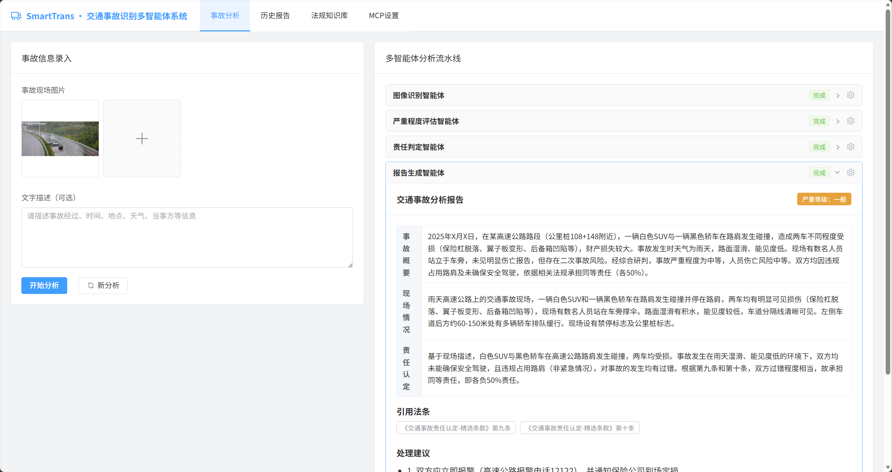
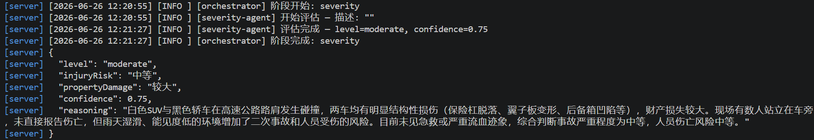
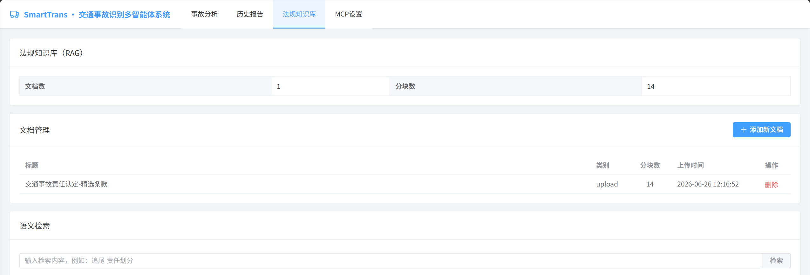
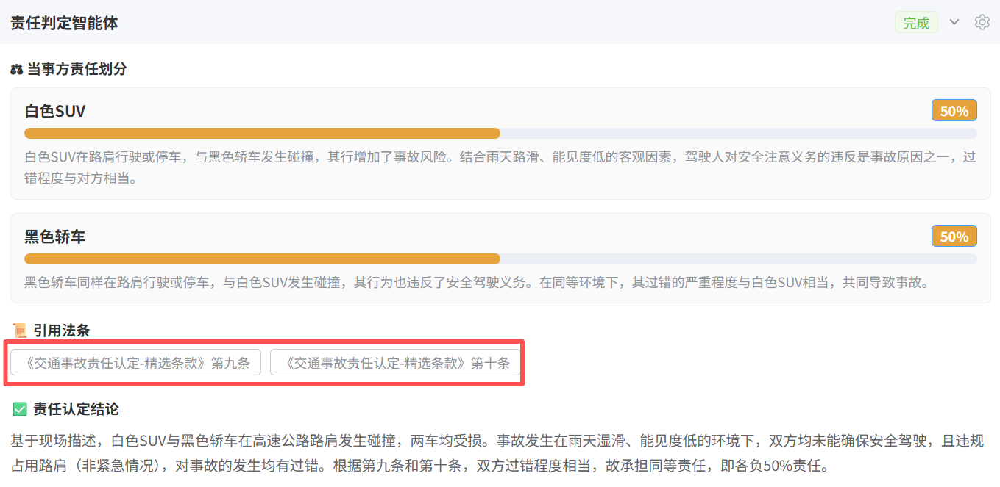
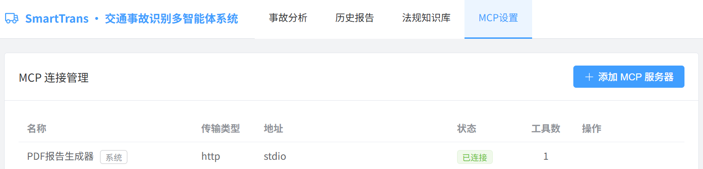
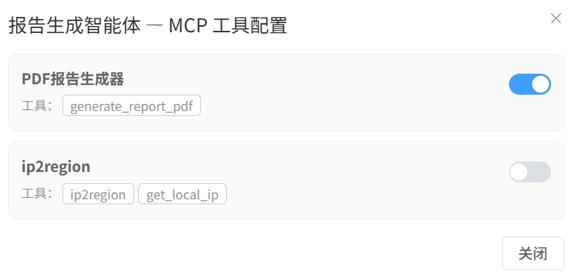

# SmartTrans 使用手册

> 本手册以交通事故分析为场景，带你理解 AI 智能体的四个核心能力跃迁：从**会说话**，到**有知识**，到**能办事**，再到**不改代码就能进化**。

---

## 目录

- [第一阶段：提示词与多智能体协作](#第一阶段提示词与多智能体协作)
- [第二阶段：RAG 知识增强](#第二阶段rag-知识增强)
- [第三阶段：工具调用与 MCP](#第三阶段工具调用与-mcp)
- [第四阶段：Skills — 可复用的智能体能力包](#第四阶段skills--可复用的智能体能力包)
- [关键概念一览](#关键概念一览)

---

## 第一阶段：提示词与多智能体协作

**核心命题**：如何让 AI 从"闲聊"走向"专业"？

### 1.1 体验流程

1. 打开浏览器，访问系统首页（具体地址联系讲师获取）。
2. 确认当前在 **「事故分析」** 标签页。
3. 在左侧 **「事故信息录入」** 区域：
   - 点击 `+` 上传交通事故现场图片（支持多张）。
   - 在**文字描述**栏填写事故经过，例如：
     > 2024年6月15日下午3时，城市主干道十字路口，A车直行与B车左转发生碰撞，天气晴朗，路面干燥。
   - 点击 **「开始分析」** 按钮。
4. 观察右侧流水线的执行过程，等待报告生成。

> 💡 右上角的语言切换器支持 English、简体中文和繁體中文。整个流水线——从系统提示词到最终报告——都会在你选择的语言下运行。



### 1.2 发生了什么

系统将一次复杂的分析任务，拆解为四个**专业智能体**的接力协作：

| 阶段 | 智能体 | 职责 |
|------|--------|------|
| ① | 图像识别智能体 | 理解事故现场的视觉信息——车辆、道路、环境 |
| ② | 严重程度评估智能体 | 判断事故等级，评估人员与财产风险 |
| ③ | 责任判定智能体 | 界定各方责任，援引法律依据 |
| ④ | 报告生成智能体 | 将分散的分析整合为一份完整的决策参考 |

每个阶段右上角的状态指示器会实时变化——`等待` → `分析中` → `完成`。这不是魔法，而是**流水线架构**在运转：前一环节的输出，是后一环节的输入。

### 1.3 为什么需要"提示词"

每个智能体之所以能扮演专业角色，源于一段精心设计的 **提示词（Prompt）**——本质上，它定义了 AI 的"职业身份"。

同样是面对一张事故照片：
- 对交警说"描述现场" → 他会关注责任相关的细节。
- 对保险理赔员说"描述现场" → 他会关注损失相关的细节。
- 对普通路人说"描述现场" → 他可能只看到"两辆车撞了"。

提示词的价值不在于"让 AI 说话"，而在于**让 AI 说对话**。它把通用模型转化为领域专家——不需要重新训练模型，只需要重新定义角色。

> **本质洞察**：提示词是人与 AI 之间的"专业契约"。它不改变模型的能力边界，但决定了模型在边界内走哪条路。

### 1.4 为什么需要"多智能体"

面对复杂任务，直觉的做法是"让一个 AI 全搞定"。但实践中，这往往导致**注意力稀释**——模型在图像、评估、法律之间切换，每个环节都难以深入。

多智能体架构的本质是**认知分工**：

- 每个智能体只承担一个单一职责，提示词可以极致聚焦。
- 环节之间通过**结构化输出**传递信息——不是"一段话"，而是精确的字段（等级、比例、条款编号）。
- 任一环节的偏差可以被定位和修正，不会污染全局。

> **本质洞察**：多智能体不是"让更多 AI 干活"，而是"让每个 AI 干好一件事"。这和组织管理中的专业化分工遵循相同的逻辑。

### 1.5 关于结构化输出

值得特别关注的是：每个智能体的输出都不是自由文本，而是**严格约束的数据结构**。

这看似是一个技术细节，实则是 AI 从"对话工具"跨入"业务系统"的门槛。自由文本可以被阅读，但无法被下一环节可靠地消费；结构化数据则可以被校验、传递、统计、审计。它是智能体之间**可依赖的接口**，也是整个流水线能够自动运转的基石。



---

## 第二阶段：RAG 知识增强

**核心命题**：AI 的知识从哪里来？它凭什么说"根据相关法律法规"？

### 2.1 体验流程

1. 切换到 **「法规知识库」** 标签页。
2. 上传交通法规文档：
   - 点击 **「添加新文档」** 按钮。
   - 拖拽或选择一个 `.md` 或 `.txt` 文件（例如《道路交通安全法》条文）。
   - 点击 **「上传」**，等待处理完成。


3. 尝试**语义检索**：
   - 输入 `追尾事故责任划分`，点击 **「检索」**。
   - 观察返回结果中的**距离分数**——它衡量查询与结果的语义接近程度。

4. 回到 **「事故分析」** 页面，重新执行一次分析，对比责任判定环节的输出变化。



### 2.2 发生了什么

在没有知识库时，责任判定智能体只能说"根据相关法律法规……"——含糊、不可验证、无法追溯。

有了知识库后，它会具体列出：

- 援引了哪部法律的哪一条。
- 条文原文是什么。
- 该条文与本案的关联。




从"大概是那样"到"确实是这条"——这是质的跨越。

### 2.3 RAG 的本质：给 AI 一个书架

**RAG（检索增强生成）** 的核心理念朴素却深刻：**与其让 AI 记住一切，不如给它一个书架，需要时去查**。

传统 AI 的知识来自训练数据——它"记住"的。这带来三个无法回避的问题：

| 困境 | 本质 | RAG 的解 |
|------|------|---------|
| 知识截止 | 模型训练完成后，世界继续变化 | 文档随时更新，AI 始终引用最新版本 |
| 幻觉风险 | 模型在"不确定"时会"编造"，且编造得看似合理 | AI 被约束为只能引用检索到的真实文档 |
| 领域深度 | 通用模型对专业领域的掌握永远是"广度优先" | 专业文档构建专业知识的深度护城河 |

> **本质洞察**：RAG 解决的不是"AI 不够聪明"，而是"AI 不该凭记忆做专业判断"。这和一个医生不应凭记忆开药方是相同的道理——他应该查阅最新的药典。

### 2.4 从文档到知识：分块与向量

上传的文档不会原封不动地喂给 AI。系统做了两件事，其逻辑值得理解：

**第一，分块。** 系统自动识别文档中的 **「第X条」** 标记，按法条切分为独立的知识单元。这样做不是因为 AI 读不了长文，而是因为**精准检索需要精准的粒度**——你问"追尾责任"，系统应该返回关于追尾的那几条，而不是整部法律。

**第二，向量化。** 每个知识单元被转换为一个高维数学向量。这不是为了"加密"或"压缩"，而是为了**让语义可计算**。"追尾"和"后车撞击前车尾部"在字面上完全不同，但在向量空间中距离极近。因为向量捕捉的是"意思"，而不是"字面"。

> **本质洞察**：向量化的意义在于，它把"理解语义"这个人类独有的能力，转化为了一个数学上可度量、可排序、可优化的计算问题。

---

## 第三阶段：工具调用与 MCP

**核心命题**：AI 能不能不只是"说"，而是去"做"？

### 3.1 前置条件

MCP 功能需要在服务端启用（`MCP_ENABLED=true`）。如果导航栏看不到 **「MCP设置」** 标签，请联系管理员确认服务配置。

### 3.2 了解预置工具

1. 切换到 **「MCP设置」** 标签页。
2. 你会看到列表中有一个带 <el-tag size="small" type="info">系统</el-tag> 标记的连接：**「PDF报告生成器」**。
   - 它是系统预置的，不可删除。
   - 它提供了一个能力：将分析报告生成为正式的 PDF 文档。



### 3.3 为智能体启用工具

1. 切换到 **「事故分析」** 标签页。
2. 在右侧流水线的智能体标题右侧，点击 **齿轮图标 ⚙️**（仅在 MCP 启用时出现）。
3. 弹出 **智能体设置** 对话框——一个统一面板，包含两个标签页：
   - **「MCP工具」** 标签页：切换该智能体可用的外部工具。
   - **「技能」** 标签页：切换该智能体激活的技能（见第四阶段）。
4. 在 MCP 工具标签页中找到 **「PDF报告生成器」**，打开开关。
5. 关闭对话框。



### 3.4 运行带工具的分析

1. 上传图片和描述，点击 **「开始分析」**。
2. 分析完成后，切换到 **「历史报告」** 标签页。
3. 找到刚才的报告——你会看到 **「下载PDF」** 按钮。
4. 点击下载，获得一份格式化的正式报告文件。


### 3.5 工具调用的本质：从"会说"到"会做"

前两个阶段，AI 展示的是**认知能力**——理解图片、评估风险、检索法律。但认知的终点往往是"给出一段话"。而商业价值的闭环，通常需要一段话之后的**行动**：生成文件、发送通知、更新数据库。

**工具调用（Tool Calling）** 让 AI 跨过了这条线：

```
理解需求 → 自主决定调用什么工具 → 传递参数 → 接收结果 → 基于结果继续推理
```

关键不在于"AI 能调用一个函数"，而在于 **AI 自己判断何时调用、调用哪个、如何解读返回结果**。这不是预设的脚本流程，而是智能体在运行时的自主决策。

> **本质洞察**：没有工具调用能力的 AI 是一位"顾问"——它只能告诉你应该做什么。有了工具调用能力，AI 成了"执行者"——它可以直接去做。对企业而言，这意味着 AI 从"辅助决策"跨入了"替代执行"。

### 3.6 MCP：工具接入的"通用语言"

如果一个企业拥有 10 个内部系统和 50 个外部 API，每个都需要为 AI 单独适配——这不是技术问题，而是**规模问题**。

**MCP（模型上下文协议）** 解决的正是这个规模问题。它定义了一套标准：

- 不论工具是本地脚本、远程服务还是云端 API，**接入方式统一**。
- 不论工具的功能是什么，AI 发现工具、理解工具、调用工具的**交互方式统一**。
- 不论未来增加多少新工具，**扩展模式统一**。

类比而言：MCP 之于 AI 工具生态，犹如 USB 之于计算机外设生态。在 USB 之前，每种外设需要专属接口；在 USB 之后，一个接口连接一切。

### 3.7 系统连接与用户连接

在 MCP 设置中，连接分为两类：

| 类型 | 特征 | 管理方式 |
|------|------|---------|
| **系统连接** | 预置、不可删除，代表平台原生能力 | 由平台统一维护和升级 |
| **用户连接** | 用户自行添加，代表按需扩展的外部能力 | 用户自主管理生命周期 |

这种设计反映了一个组织原则：**平台提供稳定基础，用户注入场景专长**。系统连接定义了"开箱即用"的能力基线；用户连接则允许每个组织根据自己的业务生态，将 AI 接入专属的数据源和服务。

你可以通过 **「添加 MCP 服务器」** 来接入外部的 MCP 服务，例如地图服务、天气数据、行业数据库——让 AI 的能力版图随业务需求自由生长。

---

## 第四阶段：Skills — 可复用的智能体能力包

**核心命题**：能不能在不改一行代码的情况下，让 AI 智能体的能力持续进化？

### 4.1 体验流程

1. 切换到导航栏的 **「技能管理」** 标签页。
2. 观察预置的系统技能：
   - **`liability-enhancer`** — 带有 <el-tag size="small" type="info">系统</el-tag> 标记，不可删除。
   - 其描述说明了它的作用：为交通事故责任认定提供增强的归责逻辑指引。
3. 创建一个自定义技能：
   - 点击 **「新建技能」** 按钮。
   - 在弹出的对话框中，粘贴一段 SKILL.md 文档——这是一个带有 YAML 前置元数据和 Markdown 正文的文本。例如：

   ```markdown
   ---
   name: severity-checklist
   description: |
     严重程度评估的结构化检查清单，
     涵盖车辆损坏等级、伤情分类和环境危害评估。
   ---

   # 严重程度评估检查清单

   ## 指令

   在评估事故严重程度时，请系统性地评估以下维度：

   ### 1. 车辆损坏
   - A级：仅外观损伤（划痕、凹陷）
   - B级：功能件损伤（车灯、后视镜、车窗）
   - C级：结构损伤（车架、车轴、溃缩区）
   - D级：全损

   ### 2. 伤情分类
   - 轻微：擦伤、颈部扭伤——门诊治疗
   - 中度：骨折、需要缝合的撕裂伤——住院 < 7天
   - 重度：危及生命、永久性残疾——住院 ≥ 7天
   - 死亡：一人或多人死亡

   ### 3. 环境危害
   - 液体泄漏（燃油、机油、冷却液）
   - 道路阻塞（部分或全部车道封闭）
   - 二次碰撞风险（盲弯、高速车流）
   ```

   - 点击 **「创建」** 保存。

4. 将技能绑定到智能体：
   - 切换到 **「事故分析」** 页面。
   - 点击 **严重程度评估智能体** 旁的齿轮图标 ⚙️，打开智能体设置对话框。
   - 切换到 **「技能」** 标签页。
   - 为严重程度评估智能体打开 **`severity-checklist`** 开关。
   - 关闭对话框。

5. 运行一次分析并观察：
   - 在流水线执行过程中，严重程度评估智能体的步骤上会显示黄色 <el-tag type="warning">severity-checklist</el-tag> 标签，表示该技能已激活。
   - 最终报告中的严重程度评估应体现出结构化检查清单的思路——更系统化，包含明确的损坏等级和伤情分类。

### 4.2 发生了什么

**技能（Skill）** 是一个可复用的能力包，以 `SKILL.md` 文件的形式存储在 `server/data/skills/<skill-name>/` 目录下。每个技能包含：

- **YAML 前置元数据**：`name`（唯一标识符）和 `description`（技能功能描述）。
- **Markdown 正文**：实际注入到智能体系统提示词中的指令内容。

服务器启动时，`SkillsManager` 从磁盘解析所有 SKILL.md 文件并缓存到内存中。当流水线分析启动时：

1. 编排器为每个智能体调用 `SkillsManager.getSkillsForAgent(agentName)`。
2. 该调用合并了持久化的智能体-技能绑定（来自 `agent_skill_settings` 数据库表）和请求中的会话级选择。
3. 结果技能列表被传递给 `formatSkillForSystemPrompt()`，用清晰的边界标记包装每个技能的指令：

```
--- BEGIN SKILLS ---
[Skill: severity-checklist]
Description: 严重程度评估的结构化检查清单...
Instructions:
# 严重程度评估检查清单
...
[/Skill: severity-checklist]
--- END SKILLS ---
```

4. 这段文本被追加到智能体的系统提示词中——模型将其作为扩展的领域专业知识来阅读。

### 4.3 Skills 的本质：不改代码，让 AI 持续进化

至此，我们拥有了四种塑造 AI 智能体行为的机制。它们之间的关系值得理解：

| 机制 | 比喻 | 作用 |
|------|------|------|
| **提示词** | 岗位说明书 | 定义智能体的专业角色——*它是什么类型的专家* |
| **RAG** | 参考书架 | 赋予智能体可检索的知识——*它可以查什么事实* |
| **MCP / 工具** | 手和工具 | 赋予智能体行动的能力——*它能在世界中做什么* |
| **Skills** | 培训手册 | 赋予智能体可复用的专业模块——*它应该如何思考和操作* |

Skills 在这张版图中占据独特的位置。它既不是参考数据（RAG），也不是可执行函数（MCP）——它是**操作性的专业知识**。预置的 `liability-enhancer` 并没有增加新的法律条文；它增加的是过错判定标准、常见事故形态责任划分表、多车连环事故责任链分析方法——这些正是一位资深理赔员多年积累的默会知识。

Skills 的架构意义在于：**它将能力升级与代码变更解耦**。一位领域专家——资深的理赔员、法律专家、医学审查员——可以撰写一个 SKILL.md 文件，直接注入到相关智能体的推理过程中。不需要代码部署，不需要模型重训，不需要流水线重配置。技能可以独立启用、禁用或更新，按智能体、按会话灵活组合。

> **本质洞察**：提示词定义了智能体*是什么*。RAG 提供了智能体*能引用什么*。MCP 赋予了智能体*能做什么*。而 Skills 定义了智能体*怎么思考*——并且让这个"怎么思考"变得模块化、可替换、可由领域专家而非工程师来编写。这是从"构建一个 AI 系统"走向"运营一支 AI 团队"的关键路径。

### 4.4 SKILL.md 格式

每个技能遵循一个简单的约定：

```markdown
---
name: <唯一标识符>
description: |
  <此技能提供的功能——用于发现和选择>
---

# <标题>

## 指令

<智能体应遵循的具体指导、启发式方法、检查清单或方法论。
使用标准 Markdown——标题、表格、列表——来清晰组织内容。>
```

`name` 字段是技能的唯一标识符。`description` 出现在界面中，帮助用户了解技能的功能。正文——第二个 `---` 之后的所有内容——是将注入到智能体系统提示词中的内容。像给新员工写培训手册一样写：清晰、结构化、可操作。

---

## 关键概念一览

| 概念 | 一句话理解 |
|------|-----------|
| 提示词 | 定义 AI 的"专业身份"——不是让它说话，而是让它说对话 |
| 多智能体 | 认知分工——复杂任务拆解为可管理的专业环节 |
| 结构化输出 | 智能体之间的"可靠接口"——可校验、可传递、可审计 |
| RAG | 给 AI 一个书架——与其记住一切，不如需要时去查 |
| 向量嵌入 | 让语义可计算——把"理解意思"变成数学问题 |
| 工具调用 | AI 从"顾问"变成"执行者"——不仅能说，还能做 |
| MCP | 工具接入的通用语言——一个接口，连接一切 |
| 技能（Skill） | 可复用的能力包——不改代码，让 AI 持续进化 |
| 智能体 | 被赋予了角色、知识和工具的 AI——像一个专业的数字员工 |
